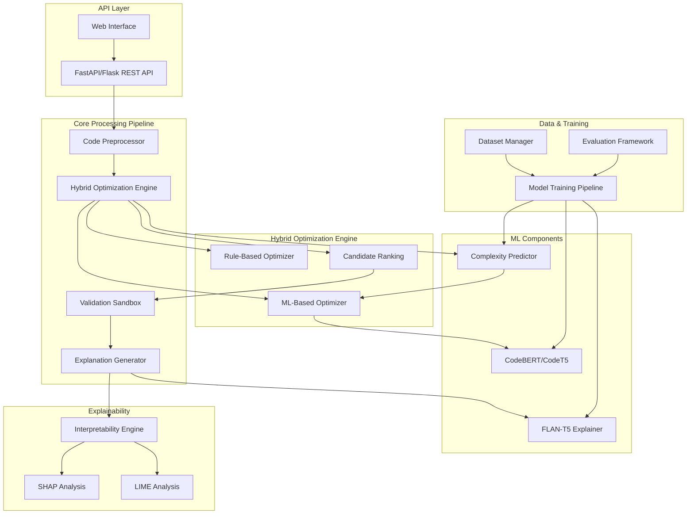

# EFFICODE AI-Powered Code Optimization System - Design Document

## Overview

EFFICODE is a comprehensive AI-powered Python code optimization platform that combines rule-based transformations with machine learning models to automatically improve code performance, predict complexity, and provide interpretable explanations. The system addresses the current implementation gaps by introducing a robust ML pipeline, comprehensive dataset management, and advanced explainability features.

## Architecture

### High-Level System Architecture



### Component Architecture

The system follows a modular architecture with clear separation of concerns:

1. **API Layer**: RESTful interface for external integration
2. **Processing Pipeline**: Sequential optimization workflow
3. **Hybrid Engine**: Combines rule-based and ML optimizations
4. **ML Components**: Specialized models for different tasks
5. **Data Infrastructure**: Dataset management and model training
6. **Explainability Layer**: Model interpretability and explanation generation

## Components and Interfaces

### 1. Code Preprocessor

**Purpose**: Parse, normalize, and prepare Python code for optimization

**Key Classes**:
```python
class CodePreprocessor:
    def parse_code(self, code: str) -> ast.AST
    def normalize_code(self, tree: ast.AST) -> ast.AST
    def extract_features(self, tree: ast.AST) -> Dict[str, Any]
    def tokenize_code(self, code: str) -> List[str]
    def validate_syntax(self, code: str) -> Tuple[bool, Optional[str]]
```

**Enhancements Needed**:
- Advanced AST normalization for consistent variable naming
- Feature extraction for ML models (complexity metrics, code patterns)
- Support for multiple Python versions and syntax variations

### 2. Hybrid Optimization Engine

**Purpose**: Orchestrate rule-based and ML-based optimizations

**Key Classes**:
```python
class HybridOptimizer:
    def __init__(self, rule_optimizer: RuleBasedOptimizer, ml_optimizer: MLOptimizer)
    def optimize(self, code: str, level: str = 'medium') -> OptimizationResult
    def generate_candidates(self, code: str) -> List[OptimizationCandidate]
    def rank_candidates(self, candidates: List[OptimizationCandidate]) -> List[OptimizationCandidate]
    def apply_optimization_pipeline(self, code: str) -> OptimizationResult

class OptimizationCandidate:
    optimized_code: str
    confidence_score: float
    applied_techniques: List[str]
    complexity_improvement: Dict[str, Any]
    validation_status: bool
```

**New Features**:
- Candidate generation from multiple optimization approaches
- Confidence-based ranking system
- Pipeline orchestration with fallback mechanisms

### 3. ML-Based Optimizer (New Component)

**Purpose**: Apply learned optimizations using CodeBERT/CodeT5

**Key Classes**:
```python
class MLOptimizer:
    def __init__(self, model_path: str = None)
    def load_model(self, model_path: str) -> bool
    def optimize_code(self, code: str, features: Dict[str, Any]) -> str
    def generate_multiple_candidates(self, code: str, num_candidates: int = 3) -> List[str]
    def calculate_confidence(self, original: str, optimized: str) -> float
    def fine_tune_model(self, training_data: Dataset) -> TrainingResult

class CodeBERTOptimizer(MLOptimizer):
    def encode_code(self, code: str) -> torch.Tensor
    def decode_optimization(self, encoding: torch.Tensor) -> str
    def apply_attention_analysis(self, code: str) -> Dict[str, float]
```

**Implementation Strategy**:
- Use pre-trained CodeBERT as base model
- Fine-tune on synthetic optimization datasets
- Implement beam search for multiple candidate generation
- Add attention visualization for explainability

### 4. Enhanced Complexity Predictor

**Purpose**: ML-based complexity prediction using Random Forest/LightGBM

**Key Classes**:
```python
class ComplexityPredictor:
    def __init__(self, model_type: str = 'random_forest')
    def extract_complexity_features(self, code: str) -> np.ndarray
    def predict_complexity(self, features: np.ndarray) -> Tuple[str, float]
    def predict_runtime(self, features: np.ndarray, input_size: int) -> float
    def train_model(self, training_data: Dataset) -> TrainingResult
    def evaluate_model(self, test_data: Dataset) -> EvaluationResult

class ComplexityFeatureExtractor:
    def extract_ast_features(self, tree: ast.AST) -> Dict[str, int]
    def extract_loop_features(self, tree: ast.AST) -> Dict[str, int]
    def extract_recursion_features(self, tree: ast.AST) -> Dict[str, int]
    def extract_data_structure_features(self, tree: ast.AST) -> Dict[str, int]
```

**Feature Engineering**:
- AST-based structural features (depth, branching factor)
- Loop nesting levels and iteration patterns
- Recursion depth and call patterns
- Data structure usage patterns
- Code size and complexity metrics

### 5. Dataset Management System (New Component)

**Purpose**: Generate, manage, and preprocess training datasets

**Key Classes**:
```python
class DatasetManager:
    def generate_synthetic_data(self, num_samples: int) -> Dataset
    def load_github_data(self, repositories: List[str]) -> Dataset
    def preprocess_dataset(self, raw_data: Dataset) -> Dataset
    def split_dataset(self, dataset: Dataset, ratios: Tuple[float, float, float]) -> Tuple[Dataset, Dataset, Dataset]
    def augment_dataset(self, dataset: Dataset) -> Dataset

class SyntheticDataGenerator:
    def generate_algorithm_pairs(self) -> List[Tuple[str, str]]
    def generate_complexity_examples(self) -> List[Tuple[str, str]]
    def generate_optimization_examples(self) -> List[Tuple[str, str, List[str]]]
    def create_fibonacci_variants(self) -> List[Tuple[str, str]]
    def create_sorting_variants(self) -> List[Tuple[str, str]]
```

**Data Sources**:
- Synthetic algorithm implementations (bubble sort → merge sort)
- GitHub repository mining with permissive licenses
- Hand-curated optimization examples
- Algorithm competition problems and solutions

### 6. Model Training Pipeline (New Component)

**Purpose**: Train and fine-tune all ML models in the system

**Key Classes**:
```python
class ModelTrainer:
    def train_codebert_optimizer(self, dataset: Dataset) -> TrainingResult
    def train_complexity_predictor(self, dataset: Dataset) -> TrainingResult
    def fine_tune_explanation_model(self, dataset: Dataset) -> TrainingResult
    def evaluate_all_models(self, test_datasets: Dict[str, Dataset]) -> EvaluationReport

class TrainingConfig:
    model_type: str
    hyperparameters: Dict[str, Any]
    training_epochs: int
    batch_size: int
    learning_rate: float
    validation_split: float
```

**Training Strategy**:
- Multi-stage training with curriculum learning
- Cross-validation for robust model evaluation
- Hyperparameter optimization using Optuna
- Model checkpointing and version management

### 7. Explainability Engine (New Component)

**Purpose**: Provide interpretable explanations using SHAP/LIME

**Key Classes**:
```python
class ExplainabilityEngine:
    def __init__(self, ml_optimizer: MLOptimizer)
    def explain_optimization_decision(self, code: str, optimized_code: str) -> ExplanationResult
    def generate_shap_analysis(self, code: str) -> SHAPResult
    def generate_lime_analysis(self, code: str) -> LIMEResult
    def visualize_attention_weights(self, code: str) -> AttentionVisualization

class SHAPAnalyzer:
    def analyze_feature_importance(self, code: str, model: MLOptimizer) -> Dict[str, float]
    def generate_waterfall_plot(self, shap_values: np.ndarray) -> PlotData
    def identify_key_code_sections(self, code: str, shap_values: np.ndarray) -> List[CodeSection]

class LIMEAnalyzer:
    def explain_local_prediction(self, code: str, model: MLOptimizer) -> LIMEExplanation
    def perturb_code_features(self, code: str) -> List[str]
    def analyze_perturbation_impact(self, original: str, perturbations: List[str]) -> ImpactAnalysis
```

**Explainability Features**:
- SHAP values for global feature importance
- LIME for local prediction explanations
- Attention weight visualization for transformer models
- Code section highlighting based on importance scores

### 8. Enhanced Validation Sandbox

**Purpose**: Secure execution and functional equivalence testing

**Key Classes**:
```python
class ValidationSandbox:
    def __init__(self, container_runtime: str = 'docker')
    def execute_code_safely(self, code: str, test_inputs: List[Any]) -> ExecutionResult
    def compare_outputs(self, original_result: ExecutionResult, optimized_result: ExecutionResult) -> bool
    def measure_performance(self, code: str, test_inputs: List[Any]) -> PerformanceMetrics
    def detect_security_issues(self, code: str) -> List[SecurityIssue]

class PerformanceProfiler:
    def profile_execution_time(self, code: str, inputs: List[Any]) -> TimeProfile
    def profile_memory_usage(self, code: str, inputs: List[Any]) -> MemoryProfile
    def generate_performance_report(self, profiles: List[Profile]) -> PerformanceReport
```

**Security Enhancements**:
- Docker/Firecracker-based isolation
- Resource limits (CPU, memory, time)
- System call filtering
- Network access restrictions

## Data Models

### Core Data Structures

```python
@dataclass
class OptimizationRequest:
    code: str
    optimization_level: str = 'medium'
    test_inputs: Optional[List[Any]] = None
    timeout: int = 60
    enable_explainability: bool = False
    target_complexity: Optional[str] = None

@dataclass
class OptimizationResult:
    original_code: str
    optimized_code: str
    complexity_before: str
    complexity_after: str
    explanation: str
    applied_techniques: List[str]
    performance_improvement: float
    validation_status: ValidationStatus
    explainability_data: Optional[ExplainabilityResult] = None
    processing_time: float
    confidence_score: float

@dataclass
class ComplexityPrediction:
    symbolic_complexity: str  # e.g., "O(n log n)"
    numeric_estimate: float   # runtime estimate in seconds
    confidence: float         # prediction confidence [0, 1]
    feature_importance: Dict[str, float]
    
@dataclass
class ExplainabilityResult:
    shap_values: Optional[Dict[str, float]]
    lime_explanation: Optional[Dict[str, Any]]
    attention_weights: Optional[Dict[str, float]]
    key_features: List[str]
    decision_rationale: str
```

### Database Schema

```sql
-- Model versions and metadata
CREATE TABLE model_versions (
    id SERIAL PRIMARY KEY,
    model_name VARCHAR(100) NOT NULL,
    version VARCHAR(50) NOT NULL,
    model_path TEXT NOT NULL,
    training_date TIMESTAMP DEFAULT CURRENT_TIMESTAMP,
    performance_metrics JSONB,
    is_active BOOLEAN DEFAULT FALSE
);

-- Optimization requests and results
CREATE TABLE optimization_logs (
    id SERIAL PRIMARY KEY,
    request_id UUID UNIQUE NOT NULL,
    original_code TEXT NOT NULL,
    optimized_code TEXT,
    complexity_before VARCHAR(50),
    complexity_after VARCHAR(50),
    applied_techniques JSONB,
    performance_improvement FLOAT,
    processing_time FLOAT,
    created_at TIMESTAMP DEFAULT CURRENT_TIMESTAMP
);

-- Training datasets
CREATE TABLE training_datasets (
    id SERIAL PRIMARY KEY,
    dataset_name VARCHAR(100) NOT NULL,
    dataset_type VARCHAR(50) NOT NULL, -- 'optimization', 'complexity', 'explanation'
    file_path TEXT NOT NULL,
    num_samples INTEGER,
    created_at TIMESTAMP DEFAULT CURRENT_TIMESTAMP,
    metadata JSONB
);
```

## Error Handling

### Error Categories and Strategies

1. **Syntax Errors**: Return original code with detailed error message
2. **Model Loading Failures**: Fall back to rule-based optimization
3. **Validation Failures**: Reject optimization and return original code
4. **Timeout Errors**: Return partial results with timeout indication
5. **Resource Exhaustion**: Implement graceful degradation

```python
class OptimizationError(Exception):
    """Base exception for optimization errors"""
    pass

class ModelLoadError(OptimizationError):
    """Raised when ML models fail to load"""
    pass

class ValidationError(OptimizationError):
    """Raised when optimized code fails validation"""
    pass

class TimeoutError(OptimizationError):
    """Raised when optimization exceeds time limit"""
    pass

# Error handling strategy
def handle_optimization_error(error: Exception, context: Dict[str, Any]) -> OptimizationResult:
    if isinstance(error, ModelLoadError):
        # Fall back to rule-based optimization
        return fallback_to_rule_based(context)
    elif isinstance(error, ValidationError):
        # Return original code with error explanation
        return create_error_result(context, "Validation failed")
    elif isinstance(error, TimeoutError):
        # Return partial results
        return create_timeout_result(context)
    else:
        # Generic error handling
        return create_generic_error_result(context, str(error))
```

## Testing Strategy

### Test Categories

1. **Unit Tests**: Individual component functionality
2. **Integration Tests**: Component interaction and data flow
3. **End-to-End Tests**: Complete optimization pipeline
4. **Performance Tests**: Scalability and resource usage
5. **Security Tests**: Sandbox isolation and input validation
6. **Model Tests**: ML model accuracy and robustness

### Test Data Strategy

```python
class TestDataManager:
    def generate_test_cases(self) -> List[TestCase]:
        return [
            # Algorithm optimization tests
            TestCase("fibonacci_recursive", "fibonacci_iterative", "O(2^n)", "O(n)"),
            TestCase("bubble_sort", "merge_sort", "O(n²)", "O(n log n)"),
            TestCase("linear_search", "binary_search", "O(n)", "O(log n)"),
            
            # Edge cases
            TestCase("empty_function", "empty_function", "O(1)", "O(1)"),
            TestCase("syntax_error", None, None, None),
            TestCase("infinite_loop", None, None, None),
            
            # Security tests
            TestCase("malicious_code", None, None, None),
            TestCase("resource_exhaustion", None, None, None)
        ]
```

### Continuous Integration

- Automated testing on code changes
- Model performance regression testing
- Dataset validation and quality checks
- Security vulnerability scanning
- Performance benchmarking

## Performance Considerations

### Optimization Strategies

1. **Model Caching**: Cache loaded models in memory
2. **Result Caching**: Cache optimization results for identical code
3. **Batch Processing**: Process multiple requests together
4. **Async Processing**: Non-blocking optimization pipeline
5. **Resource Pooling**: Reuse sandbox containers

### Scalability Architecture

```python
class OptimizationService:
    def __init__(self):
        self.model_cache = ModelCache(max_size=3)
        self.result_cache = LRUCache(max_size=1000)
        self.worker_pool = ThreadPoolExecutor(max_workers=4)
        self.sandbox_pool = SandboxPool(pool_size=10)
    
    async def optimize_code_async(self, request: OptimizationRequest) -> OptimizationResult:
        # Check cache first
        cache_key = self.generate_cache_key(request)
        if cached_result := self.result_cache.get(cache_key):
            return cached_result
        
        # Process asynchronously
        result = await self.worker_pool.submit(self.process_optimization, request)
        
        # Cache result
        self.result_cache.set(cache_key, result)
        return result
```

### Resource Management

- Memory-efficient model loading
- GPU utilization for large models
- Disk space management for datasets
- Network bandwidth optimization
- Container resource limits

## Security Considerations

### Input Validation

```python
class SecurityValidator:
    def validate_code_input(self, code: str) -> ValidationResult:
        # Check for malicious patterns
        malicious_patterns = [
            r'import\s+os',
            r'import\s+subprocess',
            r'exec\s*\(',
            r'eval\s*\(',
            r'__import__',
            r'open\s*\(',
            r'file\s*\('
        ]
        
        for pattern in malicious_patterns:
            if re.search(pattern, code, re.IGNORECASE):
                return ValidationResult(False, f"Potentially malicious code detected: {pattern}")
        
        return ValidationResult(True, "Code validation passed")
```

### Sandbox Security

- Container isolation with minimal privileges
- Network access restrictions
- File system access controls
- Resource consumption limits
- Process monitoring and termination

### Data Privacy

- No persistent storage of user code without consent
- Anonymization of optimization logs
- Secure model training data handling
- GDPR compliance for user data

## Deployment Architecture

### Production Deployment

```yaml
# docker-compose.yml
version: '3.8'
services:
  efficode-api:
    build: .
    ports:
      - "8000:8000"
    environment:
      - MODEL_CACHE_DIR=/app/models
      - REDIS_URL=redis://redis:6379
    volumes:
      - ./models:/app/models
    depends_on:
      - redis
      - postgres
  
  redis:
    image: redis:alpine
    ports:
      - "6379:6379"
  
  postgres:
    image: postgres:13
    environment:
      POSTGRES_DB: efficode
      POSTGRES_USER: efficode
      POSTGRES_PASSWORD: ${DB_PASSWORD}
    volumes:
      - postgres_data:/var/lib/postgresql/data
  
  nginx:
    image: nginx:alpine
    ports:
      - "80:80"
      - "443:443"
    volumes:
      - ./nginx.conf:/etc/nginx/nginx.conf
    depends_on:
      - efficode-api

volumes:
  postgres_data:
```

### Monitoring and Observability

- Application performance monitoring (APM)
- Model performance tracking
- Resource utilization monitoring
- Error rate and latency metrics
- User behavior analytics

This design addresses all the gaps identified in your current implementation and provides a comprehensive roadmap for building the complete EFFICODE system as envisioned in your original specification.